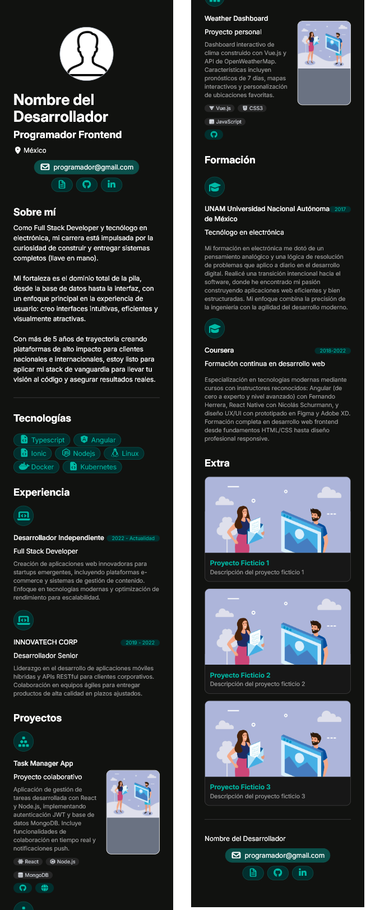

# Web Portfolio Template

A simple web portfolio template inspired by [MoureDev's portfolio template](https://github.com/mouredev/portafolio-template).

## Why This Project?

This project was created for several reasons:
- As a personal practice project to improve coding skills
- To build a personal portfolio website
- To create an easy-to-implement solution without complex dependencies or unfamiliar libraries

## Advantages and Disadvantages

### Advantages
- **Mobile Responsive**: The template is optimized for mobile devices, providing an improved viewing experience across different screen sizes.

### Disadvantages
- **Color Customization Complexity**: Changing the portfolio's color scheme requires globally replacing color references (e.g., "teal"), which can be more complex than other customization methods.

## Screenshots

### Desktop View

### Mobile View

## Technologies Used

- HTML
- CSS (Tailwind CSS)
- JavaScript

## Configuration

- **Content**: Edit `portfolio.json` to customize your portfolio data
- **Styling**: Uses Tailwind CSS for responsive design
- **Colors**: Change the color scheme by globally replacing "teal" with colors from the [Tailwind CSS documentation](https://tailwindcss.com/docs/customizing-colors)
- **Icons**: Utilizes [FontAwesome](https://fontawesome.com/icons) for icons

## Usage

1. Clone or download this repository
2. Edit `portfolio.json` with your personal information
3. Customize colors if desired by replacing "teal" references
4. Deploy the static files to your hosting platform

For more advanced color customization or additional features, consider using the [original MoureDev project](https://github.com/mouredev/portafolio-template).

## Features

- **Componentization in Pure JavaScript**: The project implements componentization using vanilla JavaScript, allowing for modular and reusable UI elements.
- **Utils Folder**: Contains HTML templates used by the components.

## Deployment

Since this is a static website (HTML, CSS, JS), you can deploy it to any static hosting service such as:
- GitHub Pages
- Netlify
- Vercel
- Firebase Hosting

**Files to upload for deployment:**
- `index.html`
- `assets/` folder
- `components/` folder
- `portfolio.json`

Simply upload these files or connect your repository for automatic deployment.